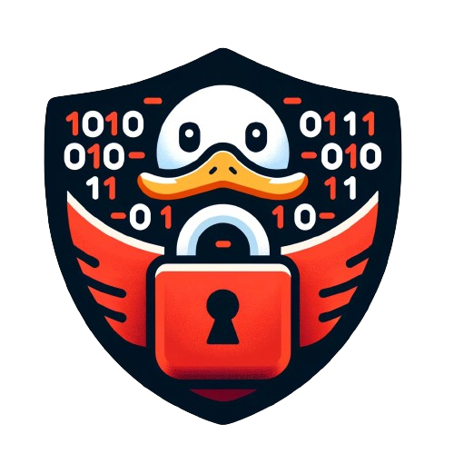

    

# Introduction

This project has been created at HEIG-VD during the fifth semester of a Bachelor's degree.
The purpose of this project was to create a complex system from scratch and think about the cryptographic implementations behind.
The project consists of a secure network file system that should be able to easily allow a user to connect from everywhere, download/upload files, share/unshare folders, and change passwords.

# Project specifications

## Main features

This section will briefly explain the few main features of the project; for more details, see the explanations in the related sections.

- Registration and login: A user creates an account and authenticates themselves only using a master password. These operations should be possible from anywhere without having to manage any cryptographic key.
- File management: It is possible to easily create files on the system and retrieve them without having to manage any security measures.
- Folder sharing: A folder can be shared with another user by providing their username. A shared folder can be revoked by any of the participants in the share.
- Password changing: Passwords can be changed at any time without causing data loss.

## Environment

- Communications with TLS: We assume all the communications between the client and the server are protected using TLS. Since the current last version is TLS 1.3, it's highly recommended to use this version. For this project, we will assume the communication between the client and the server are using TLS 1.3. Note that TLS will work without 0-RTT to prevent the possibility of replay attacks.
- Active adversaries: The files and folders should be protected against active adversaries. This means all the content, names, and keys **should** be encrypted while they are at rest on the server.
- Honest-but-curious (HBC): Refers to a scenario where the server faithfully follows the specified communication protocols and procedures, but it also attempts to extract or learn as much information as possible from the data passing through it.

## Threat model

To define the threat model, we will work according to the [OWASP](https://owasp.org/www-community/Threat_Modeling) recommendations for threat model design.

**Subjects:** The main subject is the cloud file server. It plays the role of an interface between the client sending/requesting content and the storage at rest.
Then we have a client that will handle all the encryption/decryption. Nothing leaves the client without being secured.

**Assumptions:** The client is supposed to be secure; this system won't be secure if an attacker controls the client's device.
The server is initially secure, but it is possible for an attacker to compromise its state and read/edit the files.
The communication between the two subjects is totally secure with TLS 1.3. If it's not the case, this threat model won't apply.

**Potential threats and mitigations:**

- Server compromise by an attacker that will modify the data.
- Connection compromised by an attacker.

These can be easily countered by using some authenticated encryption.

**Validation and verification methods :**

- Do security audit on the system.
- Monitor network and server activities to notice unusual behaviors.

# Architecture

This section will present the flow of the system, the cryptographic primitives used and the client/server communication.

## Overview

Before discussing each feature individually, it's important to understand the cryptographic primitives implemented in the client and the server, what they generate, and how they will be used.
To represent all these aspects, I designed an overview schema that illustrates all the points mentioned above.
Additionally, note that the architecture is highly inspired by the [Bitwarden](https://bitwarden.com/help/bitwarden-security-white-paper/#overview-of-the-master-password-hashing-key-derivation-and-encryption-process) architecture.
This choice was made because Bitwarden is a well-known password manager and serves as a good example of how to implement a secure system.
I also have some prior experience with it, as I implemented my own password manager in a previous project.

### Architecture explanation

First of all, the schema below represents the overview when a user registers on the system.
The process is the same for login, with the difference that the user already has an account, and the server already has the user's data.
The user just needs to retrieve and decrypt it, as we will see below.

The schema illustrates all the operations and the key generation process.
To delve into the process, we have a first part consisting of Argon2id and two HKDF steps that allow us to derive two keys from the master password.
This results in two secrets: one for authenticating to the server and another for encrypting/decrypting the generated symmetric key.

Next, we have the symmetric key generation.
This key is used to encrypt/decrypt the data stored in the root folder (files, folders, and metadata) (see below for more details).
Protecting the key with the derived value from the master password ensures a secure way to store the key on the server and retrieve it when the user connects from anywhere.
The user will need to provide their master password to decrypt the key and then decrypt the data.

Finally, we have the asymmetric key generation. This key is used to share folders with other users.
There is a section below explaining this, but essentially, we encrypt the symmetric key of the shared folder with the recipient user's public key.
The recipient can retrieve this protected key from the metadata of the shared folder and decrypt it with their private key.
Then, they use the decrypted symmetric key to access the folder's content.
This private key is protected with the symmetric key we just decrypted with the master password, allowing us to store the private key on the server and retrieve it when the user connects from anywhere.

To summarize, during registration, we generate at least three keys stored on the server.
Two of them are protected (encrypted): the symmetric key of the user's root folder (used for encrypting/decrypting content) and the user's private key (used for decrypting the symmetric keys of shared folders).
The third key is a public key used to encrypt the symmetric keys of shared folders for sharing with other users.
When a new folder is created, a new symmetric key is generated and encrypted with the parent folder's symmetric key.
To access the content of a given folder, we must first decrypt all the symmetric keys of the folders above, a process that will be explained in the sections about folder management.

### Algorithms

I will briefly explain why each algorithm has been chosen and what are the main characteristics of each one.
It's important to note that some of the algorithms where chosen because of the restrictions of the language used.

#### Argon2id

Argon2id is a recent and highly efficient password hashing function that is currently recommended for secure password storage.
Its main advantage is its high level of customization, allowing you to specify the number of iterations, memory size, and the number of threads.

Argon2 has three variants: Argon2d, Argon2i, and Argon2id.
Argon2d is more resistant against GPU attacks, while Argon2i is more resistant against side-channel attacks.
Argon2id is a combination of both and is the recommended choice. In the code, I've opted to use version 19 of Argon2id.

For this project, I've chosen specific parameters based on the recommendations in [RFC 9106](https://datatracker.ietf.org/doc/html/rfc9106#name-recommendations):

- Memory size: 64 MiB
- Number of iterations: 3
- Number of threads: 1

These parameters strike a balance between security and performance after checking various sources and conducting tests.

In the schema, Argon2id is used on both the server and the client.
On the client side, it's the first step of the key derivation process, deriving a key from the master password and using the username as a salt.
We chose a non-unique salt to facilitate user access from anywhere without having to store the salt.
It wouldn't be feasible with a random salt, as each connection would be more complex.
Note that the salt is also hashed with SHA-256 before being used, resulting in a 32-byte size.

On the server side, Argon2id is used before storing the password with a random salt.
This approach ensures that the server stores a unique salt for each user, adding an extra layer of security.
It's essential to emphasize that using Argon2id in conjunction with the HKDF function (as presented below) is crucial for meeting the requirement of allowing users to connect from anywhere without having to store any cryptographic keys.
This is because the protection of keys and authentication relies entirely on the user's master password.

#### HKDF

HKDF is a key derivation function used to derive a key from a master key. The function operates using SHA-256 as a hash function.
I've assessed SHA-256 as secure enough to be used in this project, with a very low probability of collision (approximately $2^{128}$ using the birthday paradox).
HKDF proves to be valuable due to its property called "context," which allows the derivation of different keys from the same master key.
The salt is also fixed to enable this operation from anywhere. Since the hashing function is SHA-256, the resulting output key will be 32 bytes long.

#### XChaCha20-Poly1305

ChaCha20 will be used to encrypt all the data we store on the server, including file content, file names, folder names, asymmetric keys, and more.
ChaCha20 is an exceptionally fast stream cipher that can be combined with Poly1305 to achieve authenticated encryption.
Furthermore, the use of a stream cipher allows us to encrypt data of any size without worrying about padding, and the output data will be the same size as the input data.
This is essential to meet the requirements of our threat model, which necessitates protection against active adversaries.
For this project, I've chosen to use the XChaCha20-Poly1305 variant because it offers nonce misuse-resistant properties.
While AES-GCM-SIV could provide similar properties, I found it easier to implement XChaCha20-Poly1305 in Rust, and personally, I prefer ChaCha20 over AES.

#### RSA-OAEP

RSA-OAEP will be used to manage all the asymmetric aspects of this project.
This choice is particularly valuable because one of the project's requirements is to enable users to share folders with others.
To achieve this, we will encrypt the symmetric key of the folder with the recipient user's public key.
When a user connects for the first time, we will create a key pair for them and store it on the server, with the private key encrypted.
I've opted for RSA-OAEP over other hybrid encryption schemes like ECIES or RSA-KEM because it's widely used and relatively easy to implement.
I wanted to avoid unnecessary complexity when a reliable and secure algorithm is readily available.
The OAEP variant offers the best of both RSA and addresses certain vulnerabilities.

#### CSPRNG

The need for random numbers arises in many places in this project, primarily in generating keys for both symmetric and asymmetric encryption.
Random numbers are also used in generating salts, IVs, and more.
I decided to use the recommended Cryptographically Secure Pseudo-Random Number Generator (CSPRNG), as taught in the course and widely adopted in Rust.

My choice was to select the OS's CSPRNG because it's the most secure and straightforward option.
This CSPRNG will be used to generate a 256-bit long sequence for the symmetric key.
According to ECRYPT recommendations on [keylength.com](https://www.keylength.com/en/3/), this size provides sufficient long-term protection.
The time difference to generate a 128-bit key versus a 256-bit key is not significant, so I opted for the 256-bit key.

For the asymmetric key, I chose a 3072-bit long modulus, also in line with ECRYPT recommendations, although this size is more suitable for near-term protection.
Generating random bits of this size already consumes a significant amount of time, so I didn't want to go higher.

## Code organization

This section will explain how the code was separated into multiple files to organize the project.
It will also describe the structures used to store the data.
This part will not cover any cryptographic implementation, but it could be useful to have a better understanding of the explanations in the next sections.

Also, note that I won't detail all the files.
Some of the files are very simple, like the `consts.rs` file, and don't require any explanation.
I will focus on the particularities of my implementation.

### Files organization

To simulate a client/server architecture, I decided to separate the code into two parts/folders.

The client folder has an entrypoint file called `menu.rs`, where all interaction with the user takes place.
Once the user has interacted with the menu, there are two choices: authentication type (register, login, change password) or file/folder management type (create, download, upload, share, etc.).
The first type calls the `auth.rs` file, where these operations are managed. The second type calls the `file_manager.rs` file, where file operations are managed.

In addition to these two files, there's `crypto.rs`, where all the cryptography is implemented.
This file serves as a wrapper for all the cryptographic primitives used in the project to create my "objects," such as the master key.
Finally, there's `session.rs`, which functions like web/PHP session variables.
I store information like the current folder metadata, the state of the keychain for symmetric keys, the path, etc.
This allows me to access this information throughout the program without needing to pass them as parameters.

The server folder has an entrypoint file called `api.rs`.
I made this choice to closely simulate how a server would be implemented if it were connected to the network.
If I ever decide to implement a real server, I would only need to change the content of this file while keeping the backend structure the same.
Depending on the type of request, the server will call either the `auth.rs` or `file_manager.rs` file.
The server also has its own `crypto.rs` file that fulfills all its cryptographic needs.

Both the client and server parts share a common file called `models.rs`.
This file contains all the structures used to store data. Detailed explanations of these structures will be provided in the next section.

### Structures

First we have the `UserMetadata` structure. It contains all the information about a user and I mainly use it at the registration and login.
I pass this object to the server and the server also returns this object to the client.
It represents the content of the files stored in the `/users` folder on the server.
It also contains the information about the shares of the user with a vector of `UserShareData` that contains the path to the share, its name (encrypted) and the key to decrypt the content of the share (symmetric key encrypted with the user's public key).

Then we have the `DirectoryMetadata` structure. It represents the content of the json files stored at each folder level.
It contains the information about the files and folders in the current folder.
The `FolderMetadata` stored in the `DirectoryMetadata` structure contains information such as the symmetric key of the folder, the name of the folder (encrypted) and the list of users that have access to the folder.
This list is a vector of `FolderShareData` that contains the usernames who have access to the folder.
The `FileMetadata` stored in the `DirectoryMetadata` structure contains information such as the name of the file (encrypted).

There is a structure to represent a file called `FileData`. I use it to simplify the passing of the file between the client and the server.
It contains the name, the path and the content of the file.

Finally, we have the `DirectoryContentMap` structure. It's a map that maps the clear name of a file/folder to the encrypted name of the file/folder.
This map is created each time the current directory is updated and allows to easily do the transition between the file the user requested and its state on the server.
This structure also contains the sharing state of the folder in the directory. It's a boolean that is set to true if the folder is a shared folder.
This way I can easily determine if I have to use my own symmetric key to decrypt the content of the folder or if I have to use the symmetric key of the shared folder.

## Features

### Account management

#### Registration

The diagram above is a sequence diagram representing the processes described in the overview section.
It illustrates the order of operations, emphasizing that the client processes everything locally and only sends encrypted data to the server.
The server's role primarily involves a single cryptographic operation (Argon2id hashing), while the rest consists of receiving and storing data.

When a user registers, the server creates a user's metadata file and stores it alongside other user's metadata.
Additionally, it creates a root folder for the user, containing a metadata file that pertains to the user's future files and folders.
For more details on metadata and root folder management, please refer to the related sections below.

#### Login

The login process is similar to registration, with the key difference being that no new data (keys, etc.) are generated.
During login, the user authenticates to the server by performing the classical derivation process (Argon2id + HKDF).
If the provided hash matches what is stored on the server, the user is considered authenticated, and the server sends them encrypted data.

The encrypted data includes the folder's metadata along with the symmetric key used to decrypt the content of that folder and all the information about the content itself (file names, folder names, etc.).
The user also receives their encrypted private key (which they can decrypt using the received symmetric key after decryption), allowing them to use it for shared folders with other users.

It's crucial to note that once the user is connected, they store various information locally in the session.
This includes their private key, the keychain (chaining of all the symmetric keys of the folders they've navigated through), the current directory's metadata (information about the files and folders in the current folder), and other information used for user experience (UX) purposes or to simplify implementation.

This information is essential for understanding subsequent features because it explains how a user can, for example, decrypt sub-folder keys without needing to request anything from the server.
It simplifies the schemas and allows a focus on the critical aspects of each feature.

#### Change Password

The password change is very similar to the two previous operations. We need to compute the derivation again from the new password.
Then we have to decrypt the old symmetric key to re-encrypt it with the new stretched master key.
Once this is done, we can send the new value for the protected symmetric key to the server.

### Folders management

#### Root folder

During a user's registration, the server will create a root folder bearing the user's name.
This root folder will be assigned a symmetric key generated during registration.

In addition to having its own sub-folders and files, the root folder will serve as the entry point for shared folders accessible to the user.
Each folder shared with the user will be reachable from the root folder.
It's important to clarify that the shared folder isn't duplicated within the root folder; instead, it functions as a link to the shared folder (see the shared folder section below for more details).

#### Folder creation

Creating a folder is a straightforward process.
The user always has the current folder's symmetric key stored in their session data (refer to the folder navigation section below to understand how to obtain this key).
When the user wants to create a folder, they generate a new symmetric key and encrypt it using the current folder's symmetric key.
Then, they encrypt the name of the folder with the current folder's symmetric key.
Finally, they update the metadata of the current folder with the new sub-folder metadata, which includes information such as name, path, key, and more.
This updated metadata is sent to the server along with the path where the folder should be created.

#### Folder navigation

Folder navigation wasn't a strict requirement of the project, but I chose to implement it to replicate the behavior of a real file system.
Additionally, it simplified the overall project implementation since I could manage other operations in a similar folder-scoped manner.

Similar to a real file system, users can navigate both upwards and downwards in the folder hierarchy, with the root folder as the upper limit (you can't navigate higher than that).
The navigation process involves storing the current folder's symmetric key in the session data.

I introduced a concept called the "keychain," which is essentially a vector.
It starts with the root folder's symmetric key as the first element and ends with the current folder's symmetric key as the last element.
In between, you have all the symmetric keys of the folders you've navigated through. When you enter a folder, you add the folder's symmetric key to the keychain.
When you go back to the parent folder, you remove the last element from the keychain.

To facilitate navigation using the clear name of the folder, we utilize a mapping between the clear name and the encrypted name of the folder.
This mapping is stored locally and is updated each time we request the metadata of a folder (see the section discussing the code structure).

Navigating upwards is straightforward; you simply remove the last element from the keychain to obtain the symmetric key of the parent folder.
Then, you can request the directory metadata from the server and decrypt it using the last element of the keychain (the parent folder's symmetric key).
Path management also plays a role; when moving upwards, you remove the last element from the path (truncate).
If you are in the entrypoint folder of a shared folder, it indicates a return to the root folder.

For navigation downwards, you need to decrypt the folder's symmetric key stored in the metadata of the current folder.
Subsequently, you add this key to the keychain, and similar to upwards navigation, you request directory metadata from the server and decrypt it using the last element of the keychain (the child folder's symmetric key).
The path is updated accordingly, with the folder name added to the path along with a slash.

### Files management

#### File upload

Similarly to the folder creation, we will encrypt the file's name, file's content and file's path with the current folder symmetric key.
Then, we will update the metadata of the current folder with the new file metadata.
Finally, we will send the encrypted file itself to the server along the new metadata for the current directory.

#### File download

The download is easy as the upload. We just have to request the file to the server to do that we have to give the server the encrypted file name.
We can use the map stored locally that maps the clear name of the file to the encrypted name of the file, so when the user enters the name of the file, we can retrieve the encrypted name.
Then, the server receives this name and send us the corresponding file (name and content).
We can decrypt it and reconstruct the file locally.

#### File delete

While this feature wasn't initially required, I decided to implement it to make file actions more comprehensive.
It draws heavy inspiration from the file upload feature, with the primary distinction being that instead of adding a file to the metadata, we need to locate and remove it.
To initiate file deletion, the user sends the name of the file they wish to delete.
The client then searches for the corresponding encrypted name in the mapping that links plain names to encrypted names.
Subsequently, the client locates the metadata associated with this file in the vector and removes it from the current directory's metadata.
The updated metadata, without the deleted file, is then transmitted to the server.

### Sharing management

#### Share a folder

As mentioned earlier, when sharing a folder with another user, that folder will appear in the recipient's root folder.
This approach was chosen to provide a user-friendly display of shared folders without adding unnecessary complexity by creating a special folder solely for shared items.

Information about a shared folder is stored in both the user's metadata and the folder's metadata.
In the user's metadata, we store all the necessary details for a user to locate the shared folder within the server's hierarchy (encrypted path) and decrypt the symmetric key of the shared folder which is encrypted with the recipient public key.
In the folder's metadata, we store information about the user(s) who have access to the folder.

To share a folder, we must first retrieve the target folder's symmetric key from the current folder's metadata.
Subsequently, we decrypt this key and encrypt it using the public key of the user we intend to share the folder with.
Finally, we access the target user's metadata to update their shares, and we also update the current folder's metadata to include the new user in the list of individuals who have access to the folder.
All this information is transmitted to the server, enabling it to update the metadata of both the target user and the current folder.

When the user want to access a share, he simply has to request the protected key for the share and decrypt it with its private key.
He will also request the server for the shared folder metadata by providing the path we put in the user's metadata.
Once he has the metadata and the key that goes with it, he can decrypt all the content of the folder.
At this moment, the navigation and actions inside the share folder (including sub-folders) will be managed as a normal folder.

#### Unshare a folder

There are two possible versions of the unshare method: one is faster but less secure, and the other is slower but offers complete security.
While the unshare feature wasn't a strict requirement for the project's implementation, it was necessary to design it theoretically.
I chose to implement the easier version (the less secure one) in the project, as it's better to have some form of unsharing than none at all.

In the simpler version, unsharing only involves removing the share from the system.
This means that any user who has access to a shared folder can terminate the sharing for all users.
There are no key updates or similar actions. In this implementation, if a user decides to revoke a share, it will automatically remove all usernames from the folder's share list.
It will also access each user's metadata who was part of the share to eliminate the share's information.
This includes removing the folder's symmetric key from users' metadata.
However, this approach is not considered secure, as any user who had saved the symmetric keys while it was on their computer would technically still have access to the folder's information and all sub-folders below.
It will still have to access this information by another way than the normal GUI. Maybe it has to compromise the server or find a vulnerability in the communication between the server and the client.
For the average user, this may not pose a problem, but for a knowledgeable user, it represents a security vulnerability.

Now, let's discuss the optimal way to implement the unshare feature to ensure complete security.
To guard against any attacker who may have saved the keys given during sharing, we would need to update all keys related to the shared folder and all its sub-folders.
Updating all the folder keys would also require decrypting and re-encrypting all files, folders, and metadata within a given folder.
To be more precise, we would need to navigate to the lowest level of the folder hierarchy and generate new symmetric keys for decryption/encryption.
First, we have to update the content of this folder by re-encrypting all its content with the new key.

Then, we would move up one level in the hierarchy and repeat the process, generating a new symmetric and re-encrypting the folder's content with this new key and also the sub-folder's new symmetric keys generated in the previous step.
This process would continue for each level of the hierarchy, always generating keys for child folders, re-encrypting its content, moving up a level, and encrypting these new pieces of information with newly generated keys of the parent's folder.
Note that it will also be needed to update the user's metadata with the new keys, path name, etc... of the folder that is used as entrypoint to the share.

We can summarize all these heavy operations like this :

1. Go to the lowest level of the hierarchy (a folder without any sub-folders)
2. Generate a new symmetric key
3. Re-encrypt all the content of the folder with the new symmetric key
4. Move up one level in the hierarchy
5. Generate a new symmetric key
6. Re-encrypt all the content of the folder with the new symmetric key
7. Re-encrypt the symmetric key of the folder with the new symmetric key
8. Update the metadata of the folder with the new symmetric key and the new path name
9. After having updated all the sub-folders, recursively repeat steps 4 to 8 until you reach the entrypoint folder of the share
10. Update the user's metadata with the new symmetric key and the new path name of the entrypoint folder of the share

### Metadata management

To store files and folders in an encrypted manner, it's essential to store metadata that allows retrieval later.
The metadata is divided into two groups: user's metadata and folder's metadata.

The user's metadata contains the protected keys of a user (symmetric and private), as well as their public key.
It also includes the hash of the master password for user authentication. Additionally, it holds information about folder shares, specifically the owner and path to locate the folder within the folder's organization.
It also stores the encrypted name of the folder for display purposes and the symmetric key of the folder, encrypted with the user's public key, to enable decryption of the folder's content.

The second type of metadata is the folder's metadata.
It includes the owner and path to the folder for the same reasons as the user's metadata.
Within folder metadata, there are sub-categories for files and sub-folders.
The file category stores the encrypted name of the file, primarily for display and practical implementation purposes.
The sub-folder category contains the encrypted name of the folder and the encrypted symmetric key of the folder for content decryption.
Similar to user metadata, it also contains a share category for storing users with access to the folder, allowing for share revocation (see the related section below).
Note that the symmetric key of a folder will encrypt all the sub-folders symmetric keys and also all the content and name of the folder (files and sub-folders).

The image below is a schema representing the organization of the metadata, encompassing all the information described above.
It includes examples for each type of metadata to illustrate how they are stored.

# Performances and security

In terms of performance, the system performs quite well.
Only one file per folder is needed to manage the entire content of that folder.
I estimated the size of the metadata file to be about 300 bytes when there is a shared folder and a file.
This size is negligible compared to the size of the actual content (folders and files).
With 1GB of storage space, it's possible to store approximately 3000 metadata pairs of files and shared folders.
It's worth noting that the 300-byte size is mainly due to the sub-folder's metadata.
If the system only stores files, it could potentially accommodate many more file metadata entries within 1GB of space for metadata.

Concerning user's metadata, a standard file is approximately 3.5 kB in size, and adding a share to a user increases this size by about 900 bytes.
This could potentially be a weak point in the metadata architecture, as in a large-scale system with numerous users sharing multiple folders, it could lead to a significant increase in required storage space.
Currently, I don't have a solution to this problem, but it might necessitate a complete rework of the metadata architecture to address this issue.

Overall for the storage, I am happy with the outcome. The metadata for the files and folders are not very significant.
This is a good point for a large file system, because if the metadata were bigger (sometimes bigger than the files) it would have been totally unusable.
I am sure it's possible to reduce the size of the metadata file maybe by changing the format or another solution like this but for this project I decided to stay with basic encoding formats.
I would say the system is less performant with tiny files system because it won't make the most out of the metadata files.
For example storing hundreds of files that are a few bytes will be less worth, than storing hundreds of files that are a 10GB.

Note that the system isn't optimized for large files. Upload files larger than the allocated memory will probably result in a crash.
When, I did the encryption system using XChaCha20, I inspired myself from this [tutorial](https://kerkour.com/rust-file-encryption).
In this tutorial, the author explains clearly how to implement a file encryption system using XChaCha20 for larger files.
I decided to not implement this system because it was not the main goal of this project.

In terms of time performance, the system's operations are generally fast, and users won't notice any significant delays.
The registration and login processes are somewhat slower due to key generation and derivations, but even with the current time required, it's considered acceptable to wait a few extra seconds for a secure system.
The registration takes up to 5 seconds and the login up to 2 seconds. These have been measured in release mode.
All the rest of the operations once logged in the server are usually done instantly.

In terms of security, the system is heavily inspired by Bitwarden, an open-source and well-known architecture that has undergone multiple security audits without major issues.
The key generation and protection processes are secure.

Regarding data storage security, the system uses authenticated encryption with simple symmetric key encryption.
All the algorithms used are recommended and secure. One potential flaw is that each sub-folder's key is encrypted with the parent folder's key.
Therefore, if one symmetric key were to leak, all sub-folders would be compromised as well.
In the event of a leaked symmetric key, a user's only recourse would be to recreate the folder and transfer the contents of the old folder to the new one.
This would result in a new symmetric key, rendering the leaked key useless.
It's important to note that detecting whether a symmetric key has leaked is challenging, as users typically don't have means to determine this.
This is the only case that we don't cover (key leakage), otherwise the system is protected against all types of attacks for the given requirements.
